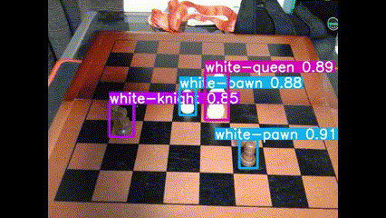
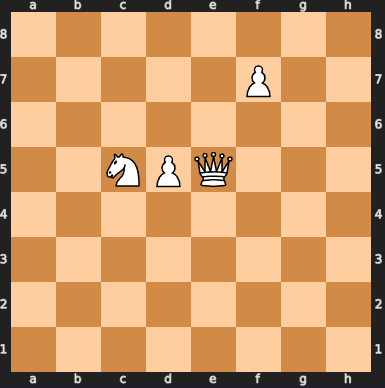

# Checkpoint Report: Computer Vision

## Computer Vision in the Project Context

For this checkpoint I am using concepts of computer vision to recognize a chess position by pointing a camera at a physical chessboard. The main idea is to be able to point a camera at an over the board chess game and have a fine tuned YOLOv5 model parse the position into a fen string so the board can be reconstructed digitally. The idea is to then use this alongside a reinforcement learning algorithm so both digital and in person chess games can be analyzed via my analysis tool.

For this project I decided to use pretrained weights of YOLOv5. I decided to use YOLOv5 since it's arguably one of the fastest flagship models out there right now for real time object detection. Since the primary goal of this portion of the project is to be able to parse live games which are input as a real time video feed, YOLOv5 seemed like the most optimal approach. I then finetuned the model on [this](https://public.roboflow.com/object-detection/chess-full/23) dataset which consists of images of chess pieces. The YOLO model has revolutionized real-time object detection by precicting both bounding boxes, and class probabilities directly from an image in one shot. Another reason I decided to use YOLO for this project was because of the highly interactive nature of the chessboard recognition task.

## Implementation Details

I was able to fine tune some pretrained weights of the popular YOLOv5 model. I was able to leverage the already efficent and accurate model and improve its recognition of chess pieces using the dataset mentioned above. Using the finetuned version of YOLO I was then able to detect the bounding boxes and confidence scores for any recognitions in the scene. Using the coordinates I was then able to calculate the corresponding grid square on the chess board where each detection was made, so for example being able to classfy `White Pawn e5`. I did this by mapping the center of each bounding box to a chessboard square. It was a fairly simple calculation to just convert the grid coordinates, I was able to use the size of the video, and since the only thing in frame is the chessboard, we can use the coordiantes of the bounding boxes along with the size size of the captured frame.

A FEN string is just string notation of a chess position. It is an efficient way of representing a chess position computationally.

## Challenges

The main challenge I am facing is that the detection of which chess piece is being recognized could be a lot better. I believe this may be due to the size of the dataset, and I plan on finding a better dataset to try and further finetune the model. There are also currently some miscalculations in how the board position is converted because the board is not necessarily the only thing in the frame, my chess board also has a border around it which means that I need to account for that offset. Currently it works somewhat well in terms of recognizing the center squares, To further improve this I belive that I need to implement an algorithm to crop out the grid so it is the only thing that is in the frame which should help improve the accuracy of detections. A few examples can be seen below, the digital boards are calculated using the generated FEN string.

## Results
### Board Position: 

### FEN string output

As we can see from the above example, the model still needs further training to properly detect the black pieces, and I need to perform some sort of filtering to ensure that the FEN string that is generated accurately represnts the live board position.